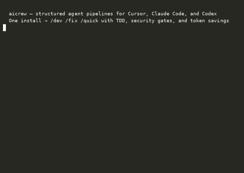

# aicrew

[](LICENSE)
[](package.json)

**A TDD-first AI development pipeline for Claude Code, Cursor, Codex, Gemini CLI, and Antigravity.**

One command set and one source of truth across every major AI coding tool — install once, drive your whole SDLC from a handful of commands.

---

## Install (30 seconds)

```bash
npx aicrew status                # no install — shows what you'd get
npx aicrew install               # all platforms
npx aicrew install claude|cursor|codex|gemini   # one platform
npx aicrew doctor                # verify MCP server binaries are reachable
```

**Requirements:** Node 18+. No extra Python packages and no npm runtime dependencies.

> MCP server binaries (graph index, token optimizer) install separately — see **MCP setup** under Advanced below, or run `npx aicrew install mcp`.

---

## Demo



Terminal recording: [`docs/demo.cast`](docs/demo.cast)

---

## The three commands you actually use

### `/dev` — full pipeline

9-phase pipeline: intake → research → brainstorm → design → implement (TDD) → tests → security → audit → conclude. Every phase stops and waits for your go-ahead.

> Use when: a new feature, a refactor, or anything that needs a design spec or touches multiple systems.

```
/dev Add rate limiting to the auth API
```

Codex: `aicrew-dev`

### `/fix` — fast bug fix

3 intake questions, then TDD straight to done. Skips brainstorm and design phases.

> Use when: you can describe what's broken and want it fixed.

```
/fix OAuth redirect returns 500 after login
```

Codex: `aicrew-fix`

### `/quick` — scoped task, lowest tokens

Scout → Act. A cheap model (`context-scout`) runs graph-first discovery (graph query ~500 tok; Scout pass may also use targeted diff/tree reads) and emits a fixed `SCOUT:` schema (~1–2 K); the main model acts from that block only — no pipeline overhead.

> Use when: a rename, a tweak, or a small well-defined addition.

```
/quick Rename UserService to AccountService across the repo
```

Codex: `aicrew-quick`

| Situation | Use |
|-----------|-----|
| New feature, refactor, or anything needing a design spec | `/dev` |
| Bug fix — you know what's broken | `/fix` |
| Small scoped task — rename, tweak, quick addition | `/quick` |

<details>
<summary>Why aicrew (pipelines, benefits, token savings)</summary>

### Pipeline depth (same token stack, different ceremony)

| Command | Phases | Use when |
|---------|--------|----------|
| `/dev` | 9 — intake → research → brainstorm → design → implement (TDD) → tests → security → audit → conclude | Feature, refactor, or anything needing a design spec |
| `/fix` | 5 — intake → bug analysis → implement (TDD) → tests → security → conclude | Bug fix with mandatory TDD |
| `/quick` | 2 — Scout → Act | Scoped task; graph-first without pipeline overhead |

### Benefits

- **TDD-first** — strict RED → GREEN → REFACTOR in `/dev` and `/fix`; tests before or with implementation
- **Phase gates** — every phase stops for your explicit go-ahead; the agent never invents your response
- **Security review** — `security-reviewer` on changed files; `security-guard.py` blocks secrets on every write
- **Scout → verify** — cheap model maps the problem; capable model acts from a verified summary only

### Token savings (illustrative figures — project-dependent)

- Graph query **~500 tok** vs repo-wide grep **~80 K** (documented ratio; [`token-foundation.md`](./skills/docs/token-foundation.md))
- Scout block **~1–2 K** `SCOUT:` schema from `context-scout` vs reading raw grep/file dumps (often **10–80 K+** depending on repo; [`speculative-context.md`](./skills/docs/speculative-context.md))
- `/handoff` **~300 tok** vs **~15 K** chat replay (estimated)

All three commands share the same 11-capability token foundation — only pipeline depth differs.

[Full pipeline reference →](docs/pipeline-overview.md)

</details>

---

## Advanced

<details>
<summary>Full command list (daily + maintenance)</summary>

Beyond the three core commands, aicrew ships a small set of daily utilities and a few rarely-used maintenance commands.

### Daily utilities

| Command | Codex skill | What it does |
|---------|-------------|--------------|
| `/conclude` | `aicrew-conclude` | End session — saves learnings, proposes commit message |
| `/session` | `aicrew-session` | Name this task so state files don't collide |
| `/handoff` | `aicrew-handoff` | Compact summary (~300 tokens) when switching tools |
| `/brainstorm` | `brainstorm` | 3 design options with trade-offs before any code |
| `/lean` | `lean` | Toggle verbosity — default terse; `/lean on` amplifies; `/lean off` (aka `/normal`) restores verbose |

### Maintenance (rare)

| Command | Codex skill | What it does |
|---------|-------------|--------------|
| `/update-skills` | `aicrew-update-skills` | Refresh or generate project-specific skills |
| `/harness-audit` | `aicrew-harness-audit` | Health-check your aicrew install |
| `/benchmark` | `aicrew-benchmark` | Estimate tokens saved (writes `.ai/reports/TOKEN_REPORT`) |

### Cross-tool handoff

Switching tools mid-task (Claude → Cursor)? Each switch costs ~300 tokens instead of ~15,000.

1. Name the session early: `/session cursor my-feature` → state file `.ai/state/AI_STATE.cursor.my-feature.md`
2. When ready to switch: `/handoff`
3. In the new tool: `Continue from .ai/state/AI_STATE.cursor.my-feature.md`

`/normal` is kept as an alias of `/lean off`. Setup actions (`install`, `update`, `status`, `agent-kit`, `cursor-plugin`) are CLI / Codex only — no slash command.

</details>

<details>
<summary>MCP setup and why codebase-memory-mcp installs separately</summary>

`aicrew install` wires MCP **config files** into each tool. It does **not** install the MCP server binaries — those are standalone programs that live on your machine, so each one is a one-time `npm install -g` (or auto-download). This separation keeps the aicrew package itself dependency-free and lets you install only the servers you want.

### Server binaries (one-time, per machine)

```bash
npm install -g codebase-memory-mcp   # required for graph queries (~500 tok vs ~80K grep)
npm install -g token-optimizer-mcp   # optional; needed for the Cursor token-optimizer entry
# context-mode: no install needed — auto-downloads via npx on first use
```

Or run `aicrew install mcp` for the full checklist with paths.

### How config is wired

| Tool | Target | Source in repo |
|------|--------|----------------|
| **Claude Code** | `~/.claude/.mcp.json` (symlink) | `config/mcp/claude.json` |
| **Cursor** | `~/.cursor/mcp.json` (symlink) | `config/mcp/cursor.local.json` |
| **Codex** | `~/.codex/config.toml` (merged) | `config/mcp/codex.toml` |

**Cursor secrets:** `config/mcp/cursor.json` is the committed template (placeholders only). `config/mcp/cursor.local.json` is gitignored; install seeds it from the template and symlinks Cursor to it.

| Server | Role | Install |
|--------|------|---------|
| **`codebase-memory-mcp`** | Graph index of functions, classes, call chains, routes | `npm install -g codebase-memory-mcp` |
| **`context-mode`** | Context shaping for long sessions | Auto via `npx` — no install needed |
| **`token-optimizer-mcp`** | Token budgeting and cache-friendly responses _(optional)_ | `npm install -g token-optimizer-mcp` |

The Cursor template also lists optional servers (GitHub, filesystem, memory, Brave, Playwright, SQLite, Postgres, GitKraken, Perplexity) — enable and fill env vars in `cursor.local.json` as needed. License notices for all wired servers: [THIRD_PARTY_NOTICES.md](THIRD_PARTY_NOTICES.md).

### Full install reference

```bash
# one-off (no global binary)
npx aicrew install
npx aicrew update
npx aicrew status
npx aicrew agent-kit init ./agent-kit
npx aicrew cursor-plugin init ./cursor-multi-tool-plugin

# global CLI (from a git clone)
cd /path/to/aicrew && npm install -g .
```

If you see **`EACCES`** on Linux:

```bash
npm install -g --prefix ~/.local/npm-global .
export PATH="$HOME/.local/npm-global/bin:$PATH"   # add to ~/.bashrc
```

What `install` does: copies packaged skills into `~/Agents/` (shared source of truth); merges skills into `~/.claude/skills/` (adds missing files, never overwrites); symlinks `~/.claude/commands/*.md` → `~/Agents/commands/*.md`; merges `codex-skills/` into `~/.codex/skills/`; registers `session-memory.py` and `security-guard.py` in `~/.claude/settings.json`; wires MCP config files. It does **not** install MCP server binaries.

</details>

<details>
<summary>Token economy and how savings work</summary>

> **See also:** [Pipeline overview](docs/pipeline-overview.md) — token foundation summary, Scout → verify, and command decision table.

A repo-wide grep can cost ~80,000 tokens and burns context fast on large codebases. aicrew routes every query to the cheapest strategy first: a `codebase-memory-mcp` graph query for "what calls `authMiddleware`?" costs ~500 tokens instead. Every entry-point command (`/dev`, `/fix`, `/quick`) carries the same token-saving foundation — only pipeline depth differs.

> Authoritative capability list: [`skills/docs/token-foundation.md`](./skills/docs/token-foundation.md)
> Full guide with worked examples: [`skills/docs/how-token-savings-work.md`](./skills/docs/how-token-savings-work.md)
> Scout → Act deep dive: [`skills/docs/speculative-context.md`](./skills/docs/speculative-context.md)

In short, the stack combines graph-first research, a speculative Scout → verify pass, layered guardrails, a context-economy read policy (diff/tree/search before whole-file reads), `.ai/state` checkpoints, `/compact` between phases, `/handoff` on tool switch, optional `context-mode` + `token-optimizer-mcp`, and terse-by-default output. See `token-foundation.md` for the per-capability savings figures.

### When to use each lever

| You want to… | Use |
|---|---|
| Explore a large codebase without burning context | `codebase-memory-mcp` graph queries (all commands use this) |
| Keep sessions from filling the context window | `/lean on` |
| Compress stale context between phases | `/compact` at phase boundaries |
| Hand off a session to a different tool | `/handoff` (~300 tokens) |
| Scout-first with minimal overhead | `/quick` (Scout → Act) |

Use `/lean off` (aka `/normal`) to restore full verbosity.

### Pipeline depth (the only thing that differs)

| Command | Phases | Use when |
|---|---|---|
| `/dev` | 9 (intake → research → brainstorm → design → implement → tests → security → audit → conclude) | Feature, refactor, or anything needing a design spec |
| `/fix` | 5 (intake → bug analysis → implement → tests → security → conclude) | Bug fix with mandatory TDD |
| `/quick` | 2 (Scout → Act) | Scoped task; graph-first without pipeline overhead |

</details>

<details>
<summary>Guardrails</summary>

aicrew uses a layered safety model. For the rail-by-rail mapping see [`skills/docs/guardrails-taxonomy.md`](./skills/docs/guardrails-taxonomy.md).

- **Input rail:** `security-guard.py` fires before every file write — blocks PEM private keys and AWS secrets outright; warns on high-entropy strings.
- **Output rail:** `security-reviewer` agent scans changed files in Phase 6 of `/dev`.
- **Phase gates:** every `/dev` and `/fix` phase stops and waits for your explicit go-ahead — the agent never invents your response.
- **Session memory:** `session-memory.py` strips `<private>…</private>` blocks before writing session journals.

| Script | Claude hook | Role |
|--------|-------------|------|
| `session-memory.py` | Stop | Session journal, optional batch typecheck, `<private>` stripping |
| `security-guard.py` | PreToolUse (Edit / Write) | Blocks obvious secrets; warns on risky patterns |

Set `ECC_HOOK_PROFILE` to `minimal`, `standard` (default), or `strict`.

</details>

<details>
<summary>Benchmark and reports</summary>

```bash
aicrew benchmark --report
```

Writes `.ai/reports/TOKEN_REPORT.<timestamp>.md` — baseline vs aicrew estimates for your codebase. All numbers are clearly labeled **estimated**.

</details>

<details>
<summary>Platform matrix and per-platform install</summary>

Every action is reachable from every supported platform. Full details live in the canonical docs:

> Complete action × platform matrix: [`skills/docs/platform-entry-points.md`](./skills/docs/platform-entry-points.md)
> Step-by-step install per provider: [`skills/docs/install-by-platform.md`](./skills/docs/install-by-platform.md)

| Action | CLI | Claude Code / Cursor / Gemini / Antigravity | Codex |
|--------|-----|---------------------------------------------|-------|
| Full dev pipeline | — | `/dev` | `aicrew-dev` |
| Fast bug fix | — | `/fix` | `aicrew-fix` |
| Scout → Act | — | `/quick` | `aicrew-quick` |
| Design brainstorm | — | `/brainstorm` | `brainstorm` |
| First-time install | `aicrew install` | — | `aicrew-install` |
| Pull latest skills | `aicrew update` | — | `aicrew-update` |
| Check install state | `aicrew status` | — | `aicrew-status` |

> Setup actions (`install`, `update`, `status`, `agent-kit`, `cursor-plugin`) are CLI / Codex only — no slash command. `/normal` is an alias of `/lean off`.

**Claude Code** (`aicrew install claude`) — slash commands from `~/.claude/commands/` (symlinked from `~/Agents/commands/`):

```
Daily:        /dev   /fix   /quick   /conclude   /brainstorm   /handoff   /session   /lean
Maintenance:  /update-skills   /harness-audit   /benchmark
```

Hooks auto-registered: `session-memory.py` (Stop) + `security-guard.py` (PreToolUse).

**Codex** (`aicrew install codex`) — skills land in `~/.codex/skills/`:

```
aicrew-dev   aicrew-fix   aicrew-quick   aicrew-conclude   aicrew-update-skills
aicrew-harness-audit   aicrew-benchmark   brainstorm   lean
aicrew-install   aicrew-update   aicrew-status   aicrew-agent-kit   aicrew-cursor-plugin
aicrew-session   aicrew-handoff   aicrew-normal
```

**Cursor** (`aicrew install cursor`) — slash commands via Claude integration; rules from `~/Agents/agents/`; MCP wired via `~/.cursor/mcp.json`. Share `.mdc` rules with `aicrew agent-kit init ./agent-kit`; scaffold a multi-tool terminal panel with `aicrew cursor-plugin init`.

**Gemini CLI** (`aicrew install gemini`) — populates `~/Agents/` and prints config instructions.

**Antigravity** — reference `~/Agents/commands/` in your Antigravity config; slash commands work natively.

### Where skills land

| Location | Contents |
|---|---|
| `~/Agents/` | Single source of truth — commands, agents, hooks, docs |
| `~/.claude/commands/` | Symlinks → `~/Agents/commands/*.md` (slash commands) |
| `~/.codex/skills/` | Codex-native skill folders (`aicrew-dev`, `aicrew-fix`, …) |
| `~/.claude/settings.json` | Merged hook entries (`session-memory.py`, `security-guard.py`) |
| `~/.cursor/mcp.json` | Symlink → `config/mcp/cursor.local.json` |
| `~/.codex/config.toml` | Patched with MCP server entries |

```
~/Agents/                 # merged from package skills/ — commands, agents, hooks, docs, bin/
~/.claude/commands/       # symlinks → ~/Agents/commands/*.md
~/.claude/skills/         # merged copy of Claude-facing skills
~/.claude/settings.json   # merged hook entries
~/.codex/skills/          # merged Codex skill packages

[your-repo]/
  .ai/skills/             # optional project overrides (version-controlled)
  .ai/state/              # optional session checkpoints
  .cursor/rules/          # optional; or symlinks from agent-kit
```

### CLI reference

| Command | Codex skill | Claude Code | Purpose |
|---------|-------------|-------------|---------|
| `aicrew install` | `aicrew-install` | — | First-time or fresh machine |
| `aicrew update` | `aicrew-update` | — | Pull new files from the package |
| `aicrew status` | `aicrew-status` | — | Show install state across all platforms |
| `aicrew doctor` | — | — | Verify MCP server binaries are installed and reachable |
| `aicrew agent-kit init [path]` | `aicrew-agent-kit` | — | Scaffold shared Cursor `.mdc` rules |
| `aicrew cursor-plugin init [path]` | `aicrew-cursor-plugin` | — | Scaffold Cursor multi-tool terminal extension |
| `aicrew benchmark` | `aicrew-benchmark` | `/benchmark` | Token savings estimate + report |
| `aicrew --version` | — | — | Print package version |
| `aicrew --help` | — | — | Help |

</details>

<details>
<summary>Pipeline reference (/dev phases, agents, project layer)</summary>

> **See also:** [Pipeline overview](docs/pipeline-overview.md) — canonical `/dev`, `/fix`, and `/quick` phase tables with gates.

| Phase | Name | Notes |
|------:|------|--------|
| 0 | Intake | Work type, clarifying questions, which stages run |
| 1 | Research | Bug analyst vs exploration |
| 2 | Brainstorm | On by default for features/refactors |
| 3 | Design | Contracts, interfaces, over/under-build flags |
| 4 | Implement | TDD default; specialist routing from changed file paths |
| 5 | Tests | Pyramid, coverage, smoke path |
| 6 | Security | Changed files only, low noise |
| 7 | Project audit | Only if project has an audit command |
| 8 | Cloud / infra | Auto when infra-related files change |
| 9 | Conclude | Memory + commit message prep |

TDD is the default in Phase 4; opt out explicitly at intake.

**State files:** `/dev` writes to `.ai/state/AI_STATE.<tool>.<session>.md`. Use `/session` early, `/handoff` when switching tools, and clean up old states with `~/Agents/bin/cleanup-ai-state.sh 3 .`.

### Specialist routing (Phase 4)

| Signals in changed paths | Agent |
|--------------------------|--------|
| `*.tsx`, `*.vue`, `*/components/*` | `frontend-specialist` |
| `*/api/*`, `*/routes/*`, `*/services/*` | `backend-specialist` |
| `*/migrations/*`, `*models*`, `*schema*` | `db-migration` |
| Performance as acceptance criterion | `performance` |

### Agent files

| Group | Agents |
|-------|--------|
| Core pipeline | `bug-analyst`, `brainstorm`, `architect`, `tdd-developer`, `test-engineer`, `security-reviewer`, `cloud-expert` |
| Phase 4 specialists | `frontend-specialist`, `backend-specialist`, `db-migration`, `performance` |
| Modes / utilities | `caveman`, `context-economy`, `context-scout`, `state-checkpoint`, `terse` |

### Project layer (`.ai/skills/`)

Use `/update-skills` (or `aicrew-update-skills`) to generate repo-local overrides:

- `.ai/skills/commands/dev.md` — planner templates, phase goals, validation, git safety
- `.ai/skills/agents/brainstorm.md` — design decisions before coding
- `.ai/skills/commands/audit.md` — domain audit gate
- `.ai/skills/hooks/audit-guard.py` — project PreToolUse checks

Commit `.ai/skills/` so the whole team shares the same guardrails.

### Interactive checkpoints

Every command (`/dev`, `/fix`, `/quick`) uses mandatory stop-and-wait gates. The agent never invents your response. On platforms without an explicit ask tool, it ends its response and waits. Phase progression always requires your explicit go-ahead.

</details>

<details>
<summary>Design principles</summary>

- **Single shared tree** — `~/Agents/` is the source of truth all tools resolve commands from
- **Merge, do not clobber** — existing `~/.claude/skills` files are kept on update
- **TDD-first** — enforced in `/dev` unless explicitly opted out at intake
- **Lean by default** — caveman/terse output and graph-first reads; `/lean off` (aka `/normal`) for verbose
- **Specialist routing** — Phase 4 routes by changed file paths, not upfront configuration
- **No npm runtime deps** — CLI is plain Node.js; hooks use Python stdlib only

</details>

---

## Acknowledgements / Inspiration

aicrew draws **architectural inspiration — ideas and patterns only, no code used** — from the projects below. For the rail-by-rail mapping of these ideas onto aicrew mechanisms, see [`skills/docs/guardrails-taxonomy.md`](./skills/docs/guardrails-taxonomy.md).

- **[rtk-ai/rtk](https://github.com/rtk-ai/rtk)** — a CLI proxy that compresses verbose shell-command output before it reaches the LLM. Three patterns informed aicrew: a thin-delegate hook architecture (hooks call a binary, decoupled from policy), fail-safe graceful degradation (a failed/missing rewrite exits 0 and runs the original command), and a cross-platform hook compatibility matrix (PreToolUse, BeforeTool, plugin API, rules-file fallback). Complementary tool — RTK and aicrew hooks coexist via different `matcher` patterns.
- **[forrestchang/andrej-karpathy-skills](https://github.com/forrestchang/andrej-karpathy-skills)** — Karpathy-style agent-safety heuristics (slow down before irreversible actions, prefer reversible steps, checkpoint state) informed aicrew's guardrail layer and phase-gate checkpoints.
- **[NVIDIA/NeMo-Guardrails](https://github.com/NVIDIA/NeMo-Guardrails)** — the input-rail / output-rail / dialogue-rail layered architecture inspired `security-guard.py` (PreToolUse), phase-gate checkpoints, and the `security-reviewer` agent pattern.
- **[chopratejas/headroom](https://github.com/chopratejas/headroom)** — context-compression patterns (CCR, ContentRouter, CacheAligner, RollingWindow, and the `headroom learn` → AGENTS.md flow) informed aicrew's context-budget concept.
- **Academic / public guidance** — Leviathan et al., ["Fast Inference from Transformers via Speculative Decoding" (2023)](https://arxiv.org/abs/2211.17192) (draft/target accept-reject loop ↔ Scout/Main handoff); ReSum (recursive summarization); CoMem (collaborative multi-agent memory); and [Anthropic's context-engineering guidance](https://www.anthropic.com/engineering/building-effective-agents) (sub-agents returning compact summaries).

No code was copied from any of the above. Runtime software that aicrew installs or wires is listed separately in [THIRD_PARTY_NOTICES.md](THIRD_PARTY_NOTICES.md).

---

## License

aicrew is MIT — see [LICENSE](LICENSE).

Third-party runtime components: [THIRD_PARTY_NOTICES.md](THIRD_PARTY_NOTICES.md)

---

### Discoverability

**GitHub topics:** `ai-agents` · `claude-code` · `codex` · `cursor` · `gemini-cli` · `antigravity` · `mcp` · `developer-tools` · `agent-skills` · `hooks` · `workflow` · `tdd` · `sdlc` · `context-engineering` · `token-optimization` · `token-saving` · `guardrails` · `ai-workflow` · `open-source` · `cli`

**Search keywords:** reduce AI coding tokens · multi-agent dev pipeline · cross-platform agent skills · TDD-first SDLC · graph-first codebase reads · Claude Code Cursor Codex Gemini hooks
